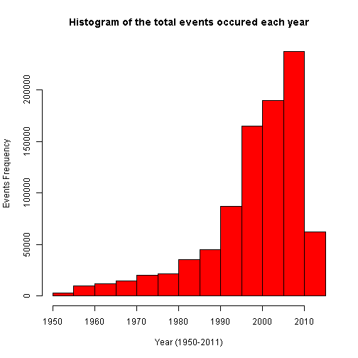
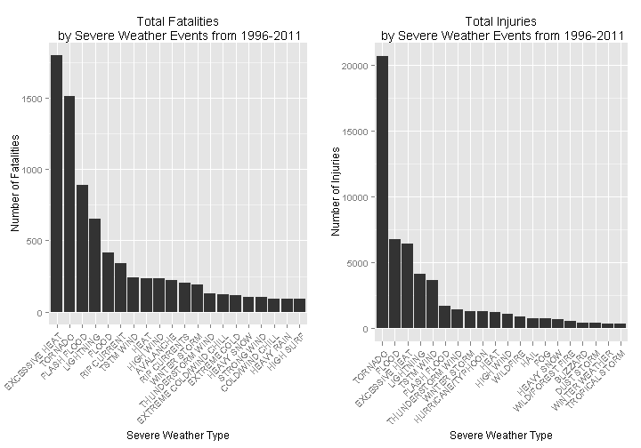
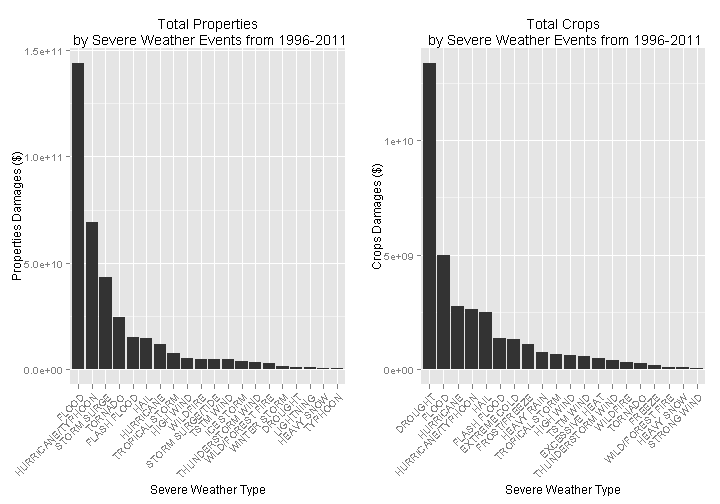

## Exploring the U.S. NOAA storm database to analysis of severe weather events that are most harmful to the population health and economy.

### Reproducible Research: Peer Assessment 2
#### J.A (newja1390@gmail.com)


### 1. Synopsis

The basic goal of this report is to explore the U.S. National Oceanic and Atmospheric Administration's (NOAA) Storm Database and answer these basic questions about severe weather events:

1. which types of events are most harmful with respect to population health?
2. which types of events have the greatest economic consequences?

The events in the database start in the year 1950 and end in November 2011.
The data of fatalities, injuries, property and crop damage will be used to decide which types of events are most harmful to the population health and economy.

### 2. Data Processing

##### 2.1. Load libraries
Load necessary libraries to perform data analysis.

```r
library(utils)
library (stringr)
library(plyr) 
library(ggplot2) 
library(grid)
library(gridExtra)
```

##### 2.2. Loading data
Unzip the data source file and load the data set.

```r
 # unzip data file and read data from dataset
   zipfile="repdata_data_StormData.csv.bz2"
   if(file.exists(zipfile))
   {
        unzip(zipfile,overwrite = TRUE)
        dataSet <- read.csv("repdata_data_StormData.csv")
    }
```

##### 2.3. Preprocessing the data

```r
 # Select needed colums of dataset for this analysis:
selectedColumns <- c("BGN_DATE", "EVTYPE", "FATALITIES", "INJURIES",
                     "PROPDMG","PROPDMGEXP", "CROPDMG", "CROPDMGEXP")
 
stormData <- dataSet[, selectedColumns]

# extract the year of events and store it in a new column('year'), in storm dataset.
stormData$year <- as.numeric(format(as.Date(stormData$BGN_DATE,
                                            format = "%m/%d/%Y %H:%M:%S"), "%Y"))

# Plotting the histogram of the events in years 1950-2011.
hist(stormData$year, 
     main="Histogram of the total events occured each year",  
     sub="",
     xlab="Year (1950-2011)",
     ylab="Events Frequency",
     col="red",
     breaks = 20)
```

 


Based on code book description([Storm Events][1]), data for years prior to 1996 is incomplete and might be incorrect. So we will filter data for years prior to 1996.


```r
# Filter data for years prior to 1996 
stormData <- stormData[stormData$year >= 1996, ]

# Clean event types
stormData$EVTYPE <- str_trim(str_to_upper(stormData$EVTYPE))
stormData$EVTYPE <-str_replace(stormData$EVTYPE,'[ ]+', " ")
stormData <- stormData[str_detect(stormData$EVTYPE, "^SUMMARY")== FALSE,]

# coefficients of property and crop damages values before cleaning :
#
# unique(stormData$PROPDMGEXP)
## [1] K   M B 0
## Levels:  - ? + 0 1 2 3 4 5 6 7 8 B h H K m M

# unique(stormData$CROPDMGEXP)
## [1] K   M B
## Levels:  ? 0 2 B k K m M

# Clean the coefficients of property and crop damages values in the PROPDMGEXP and CROPDMGEXP columns.
stormData$PROPDMGEXP <- as.character(stormData$PROPDMGEXP)
stormData$PROPDMGEXP <- gsub("h|H", "2", stormData$PROPDMGEXP)
stormData$PROPDMGEXP <- gsub("k|K", "3", stormData$PROPDMGEXP)
stormData$PROPDMGEXP <- gsub("m|M", "6", stormData$PROPDMGEXP)
stormData$PROPDMGEXP <- gsub("B", "9", stormData$PROPDMGEXP)
stormData$PROPDMGEXP <- gsub("\\-|\\+|\\?", "0", stormData$PROPDMGEXP)
stormData$PROPDMGEXP <- as.numeric(stormData$PROPDMGEXP)
stormData$PROPDMGEXP[is.na(stormData$PROPDMGEXP)] = 0

stormData$CROPDMGEXP <- as.character(stormData$CROPDMGEXP)
stormData$CROPDMGEXP <- gsub("h|H", "2", stormData$CROPDMGEXP)
stormData$CROPDMGEXP <- gsub("k|K", "3", stormData$CROPDMGEXP)
stormData$CROPDMGEXP <- gsub("m|M", "6", stormData$CROPDMGEXP)
stormData$CROPDMGEXP <- gsub("B", "9", stormData$CROPDMGEXP)
stormData$CROPDMGEXP <- gsub("\\-|\\+|\\?", "0", stormData$CROPDMGEXP)
stormData$CROPDMGEXP <- as.numeric(stormData$CROPDMGEXP)
stormData$CROPDMGEXP[is.na(stormData$CROPDMGEXP)] = 0

# coefficients of property and crop damages values after cleaning :
#
# unique(stormData$PROPDMGEXP)
## [1] 3 0 6 9

# unique(stormData$CROPDMGEXP)
## [1] 3 0 6 9

# transform data set and calculate properties and crops damages amount in dollars.
stormData <- mutate(stormData, 
                    PROPERTIES = (PROPDMG * 10^PROPDMGEXP), 
                    CROPS = (CROPDMG * 10^CROPDMGEXP))
```

##### 2.4. Find events that are most harmful with respect to population health
Calculate the number of fatalities and injuries that are caused by the severe weather events.
Then get the first 20 most severe types of weather events.


```r
# group fatalities by event type and get sum of fatalities for each type
fatalities <- aggregate(x=list(FATALITIES=stormData$FATALITIES),
                               by=list(EVTYPE=stormData$EVTYPE),
                               FUN=sum, na.rm=TRUE)

# group injuries by event type and get sum of injuries for each type
injuries <- aggregate(x=list(INJURIES=stormData$INJURIES),
                               by=list(EVTYPE=stormData$EVTYPE),
                               FUN=sum, na.rm=TRUE)

# sort by event frequency and select top 20 Injuries and Fatalities to compare.
Top20Fatalities <- head(fatalities[with(fatalities, order(-FATALITIES)), ], 20)
Top20Injuries   <- head(injuries[with(injuries, order(-INJURIES)), ], 20)

# reset row names to ordered numbers 1:20
row.names(Top20Fatalities) <- seq(length=nrow(Top20Fatalities))
row.names(Top20Injuries) <- seq(length=nrow(Top20Injuries))
```

##### 2.5. Find events that have greatest economic consequences
There are two different factors for economic consequences, those causing property damage and those causing crop damage.


```r
# group property damages by event type and get sum of property damages for each type
properties <- aggregate(x=list(PROPERTIES=stormData$PROPERTIES),
                               by=list(EVTYPE=stormData$EVTYPE),
                               FUN=sum, na.rm=TRUE)

# group crops damages by event type and get sum of crops damage for each type
crops <- aggregate(x=list(CROPS=stormData$CROPS),
                               by=list(EVTYPE=stormData$EVTYPE),
                               FUN=sum, na.rm=TRUE)

# sort by event frequency and select top 20 Property and Crop damages to compare.
Top20Properties <- head(properties[with(properties, order(-PROPERTIES)), ], 20)
Top20Crops <- head(crops[with(crops, order(-CROPS)), ], 20)

# reset row names to ordered numbers 1:20
row.names(Top20Properties) <- seq(length=nrow(Top20Properties))
row.names(Top20Crops) <- seq(length=nrow(Top20Crops))
```

### 3. Results
##### 3.1. Show the top 20 Injuries and  Fatalities and plot Injuries vs. Fatalities

```r
#show top 20 Injuries and  Fatalities data
Top20Fatalities
```

```
##                     EVTYPE FATALITIES
## 1           EXCESSIVE HEAT       1797
## 2                  TORNADO       1511
## 3              FLASH FLOOD        887
## 4                LIGHTNING        651
## 5                    FLOOD        414
## 6              RIP CURRENT        340
## 7                TSTM WIND        241
## 8                     HEAT        237
## 9                HIGH WIND        235
## 10               AVALANCHE        223
## 11            RIP CURRENTS        202
## 12            WINTER STORM        191
## 13       THUNDERSTORM WIND        130
## 14 EXTREME COLD/WIND CHILL        125
## 15            EXTREME COLD        115
## 16              HEAVY SNOW        107
## 17             STRONG WIND        103
## 18         COLD/WIND CHILL         95
## 19              HEAVY RAIN         94
## 20               HIGH SURF         90
```

```r
Top20Injuries
```

```
##               EVTYPE INJURIES
## 1            TORNADO    20667
## 2              FLOOD     6758
## 3     EXCESSIVE HEAT     6391
## 4          LIGHTNING     4141
## 5          TSTM WIND     3629
## 6        FLASH FLOOD     1674
## 7  THUNDERSTORM WIND     1400
## 8       WINTER STORM     1292
## 9  HURRICANE/TYPHOON     1275
## 10              HEAT     1222
## 11         HIGH WIND     1083
## 12          WILDFIRE      911
## 13              HAIL      713
## 14               FOG      712
## 15        HEAVY SNOW      698
## 16  WILD/FOREST FIRE      545
## 17          BLIZZARD      385
## 18        DUST STORM      376
## 19    WINTER WEATHER      343
## 20    TROPICAL STORM      338
```


```r
# need to specify the levels of factor in the approprate order 
Top20Fatalities <- within(Top20Fatalities, 
                          EVTYPE <- factor(x = EVTYPE, levels = Top20Fatalities$EVTYPE))

fatalitiesPlot <- qplot(EVTYPE, data=Top20Fatalities,weight=FATALITIES, geom="bar",binwidth=1) +               
                        theme(axis.text.x = element_text(angle = 45,hjust = 1)) +
                        xlab("Severe Weather Type") +
                        ylab("Number of Fatalities") +
                        ggtitle("Total Fatalities\n by Severe Weather Events from 1996-2011")

Top20Injuries <- within(Top20Injuries, 
                        EVTYPE <- factor(x = EVTYPE, levels = Top20Injuries$EVTYPE))

injuriesPlot <- qplot(EVTYPE, data=Top20Injuries,weight=INJURIES, geom="bar", binwidth=1) +      
                      theme(axis.text.x = element_text(angle = 45,hjust = 1)) +
                      xlab("Severe Weather Type") + 
                      ylab("Number of Injuries") +
                      ggtitle("Total Injuries\n by Severe Weather Events from 1996-2011")

# add an 1 by 2 rectangular grid to existing plots
grid.arrange(fatalitiesPlot, injuriesPlot, ncol = 2)
```

 

##### 3.2. Show the top 20 Properties and Crops damages and plot Properties vs. Crops

```r
#show top 20 Properties and  Corps damages data
Top20Properties
```

```
##               EVTYPE   PROPERTIES
## 1              FLOOD 143944833550
## 2  HURRICANE/TYPHOON  69305840000
## 3        STORM SURGE  43193536000
## 4            TORNADO  24616945710
## 5        FLASH FLOOD  15222253910
## 6               HAIL  14595143420
## 7          HURRICANE  11812819010
## 8     TROPICAL STORM   7642475550
## 9          HIGH WIND   5247860360
## 10          WILDFIRE   4758667000
## 11  STORM SURGE/TIDE   4641188000
## 12         TSTM WIND   4486156440
## 13         ICE STORM   3642248810
## 14 THUNDERSTORM WIND   3382654440
## 15  WILD/FOREST FIRE   3001782500
## 16      WINTER STORM   1532743250
## 17           DROUGHT   1046101000
## 18         LIGHTNING    743077080
## 19        HEAVY SNOW    634417540
## 20           TYPHOON    600230000
```

```r
Top20Crops
```

```
##               EVTYPE       CROPS
## 1            DROUGHT 13367566000
## 2              FLOOD  4974778400
## 3          HURRICANE  2741410000
## 4  HURRICANE/TYPHOON  2607872800
## 5               HAIL  2476029450
## 6        FLASH FLOOD  1334901700
## 7       EXTREME COLD  1308973000
## 8       FROST/FREEZE  1094186000
## 9         HEAVY RAIN   728169800
## 10    TROPICAL STORM   677711000
## 11         HIGH WIND   633561300
## 12         TSTM WIND   553915350
## 13    EXCESSIVE HEAT   492402000
## 14 THUNDERSTORM WIND   398331000
## 15          WILDFIRE   295472800
## 16           TORNADO   283425010
## 17            FREEZE   156725000
## 18  WILD/FOREST FIRE   106782330
## 19        HEAVY SNOW    71122100
## 20       STRONG WIND    64953500
```


```r
# need to specify the levels of factor in the approprate order 
Top20Properties <- within(Top20Properties, 
                          EVTYPE <- factor(x = EVTYPE, levels = Top20Properties$EVTYPE))

propertiesPlot <- qplot(EVTYPE, data=Top20Properties,weight=PROPERTIES, geom="bar",binwidth=1) +               
                        theme(axis.text.x = element_text(angle = 45,hjust = 1)) +
                        xlab("Severe Weather Type") +
                        ylab("Properties Damages ($)") +
                        ggtitle("Total Properties\n by Severe Weather Events from 1996-2011")

Top20Crops <- within(Top20Crops, 
                        EVTYPE <- factor(x = EVTYPE, levels = Top20Crops$EVTYPE))

cropsPlot <- qplot(EVTYPE, data=Top20Crops,weight=CROPS, geom="bar", binwidth=1) +      
                      theme(axis.text.x = element_text(angle = 45,hjust = 1)) +
                      xlab("Severe Weather Type") + 
                      ylab("Crops Damages ($)") +
                      ggtitle("Total Crops\n by Severe Weather Events from 1996-2011")

# add an 1 by 2 rectangular grid to existing plots
grid.arrange(propertiesPlot, cropsPlot, ncol = 2)
```

 

### 3. Conclosion
Excessive heat, tornado and flood are most harmful events with respect to population health, while flood, drought and hurricane/typhoon have the greatest economic impacts.

--------------------------------------------------------------------------------
[1]: http://ire.org/nicar/database-library/databases/storm-events/

 
